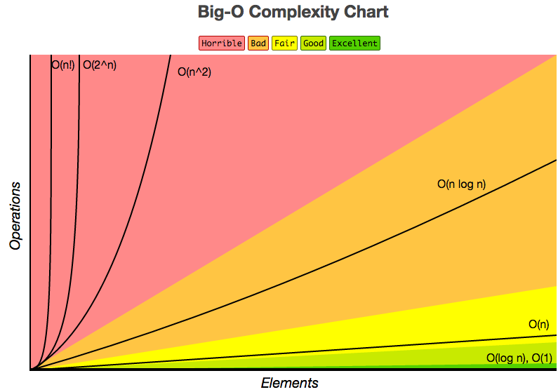
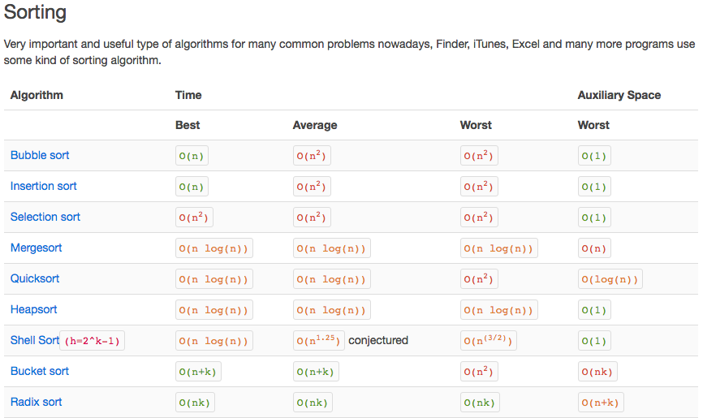
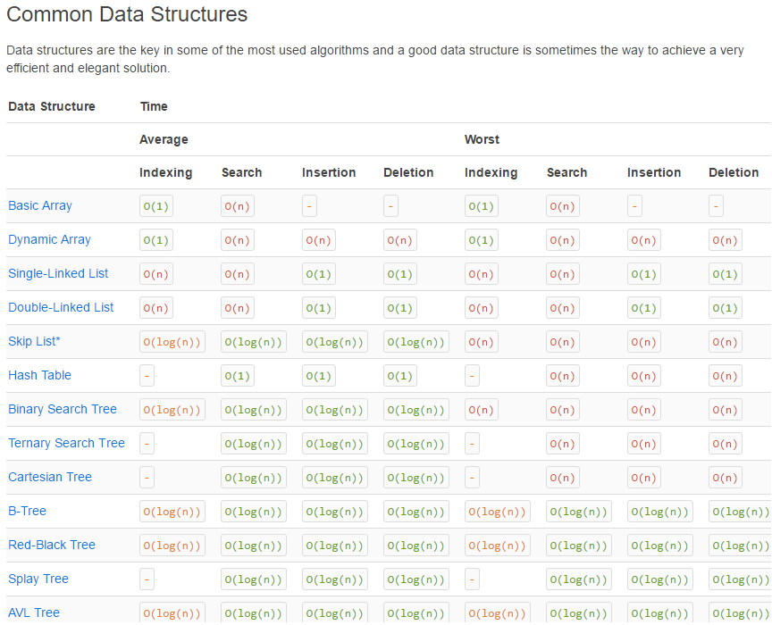
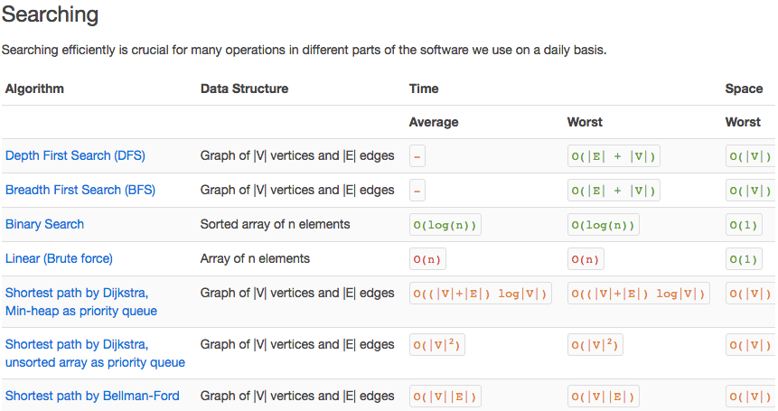

# JavaScript Basics


## Big O notation

Rules:
1. Different steps get added `O(N) + O(M) -> O(N+M)`.
2. Drop constants `O(2N) -> O(N)`.
3. Different inputs use different variables.
4. Drop non-dominant terms `O(N + N^2) -> O(N^2)`.




### Array Sorting Algorithms




### Common Data Structures




### Searching




## Hoisting

Hoisting is a process of pushing the declared variables to the top of the program while running it. In this mechanism, a JavaScript VM does two things while running a program:

1. First scan the program, collect all the variable and function declarations and assign memory spaces for it.
2. Run the program now by filling variable values assigned any, if not, fill undefined

## Strict Mode

To use place `'use strict';` at the top of a script. Strict mode makes several changes to normal JavaScript semantics. 


1. Eliminates some JavaScript silent errors by changing them to throw errors.
2. Fixes mistakes that make it difficult for JavaScript engines to perform optimizations: strict mode code can sometimes be made to run faster than identical code that's not strict mode.
3. Prohibits some syntax likely to be defined in future versions of ECMAScript.


## Null vs Undefined

JavaScript has two distinct values for nothing, `null` and `undefined`.

### undefined

`undefined` means, value of the variable is not defined. JavaScript has a global variable `undefined` whose value is "undefined" and `typeof` undefined is also "undefined". Remember, undefined is not a constant or a keyword. undefined is a type with exactly one value: undefined. Assigning a new value to it does not change the value of the type undefined.

Ways to get undefined:


- A declared variable without assigning any value to it.
- Implicit returns of functions due to missing return statements.
- return statements that do not explicitly return anything.
- Lookups of non-existent properties in an object.
- Function parameters that have not passed.
- Anything that has been set to the value of undefined.
- Any expression in the form of void(expression)
- The value of the global variable undefined

### null

`null` means empty or non-existent value which is used by programmers to indicate “no value”. null is a primitive value and you can assign null to any variable. null is not an object, it is a primitive value. For example, you cannot add properties to it. Sometimes people wrongly assume that it is an object, because typeof null returns "object".

### Werid quirk

`null == undefined` 

## Extending Core Object

A Object can be extending by declaring a method on the prototype of the object in question.

```JavaScript
Date.prototype.nextDay = function(){
  var currentDate = this.getDate();
  return new Date(this.setDate(currentDate +1));
}

var date = new Date(); 
date; //Fri May 16 2014 20:47:14 GMT-0500 (Central Daylight Time)
date.nextDay();//Sat May 17 2014 20:47:14 GMT-0500 (Central Daylight Time)
```


## Equivalience operators

`===` test for a **strict** equality, meaning that both the **type** and **value** we are comparing are the same.

`==` test for a **loose** equality, meaning only the value is tested. Note: double equals performs a **type coercion** meaning that the two values are compared after attempted to convert them into a common type.

takeaway: Triple Equals is superior to double equals. Whenever possible, you should use triple equals to test equality. By testing the type and value you can be sure that you are always executing a true equality test.

## This

At the time of execution of every function, JavaScript engine sets a property to the function called `this` which refer to the current execution context. `this` is always refer to an object and depends on how function is called. There are 7 different cases where the value of `this` varies:


1. In the global context or inside a function this refers to the window object.
2. Inside IIFE (immediate invoking function) if you use "use strict", value of this is undefined. To pass access window inside IIFE with "use strict", you have to pass this.
3. While executing a function in the context of an object, the object becomes the value of this
4. Inside a setTimeout function, the value of this is the window object.
5. If you use a constructor (by using new keyword) to create an object, the value of this will refer to the newly created object.
6. You can set the value of this to any arbitrary object by passing the object as the first parameter of bind, call or apply
7. For dom event handler, value of this would be the element that fired the event


## Pass By Value vs Reference

Primitive type (string, number, etc.) are passed by value and objects are passed by reference. If you change a property of the passed object, the change will be affected. However, you assign a new object to the passed object, the changes will not be reflected.

## Currying

Curring is partial invocation of a function. Currying means first few arguments of a function is pre-processed and a function is returned. The returning function can add more arguments to the curried function. It's like if you have given one or two spice to the curry and cooked little bit, still you can add further spice to it. A simple example will look like:

```JavaScript
function addBase(base){
  return function(num){
    return base + num;
  }
}

var addTen = addBase(10);
addTen(5); //15
addTen(80); //90
addTen(-5); //5
```

## Event Bubbling and Capturing

Event bubbling and capturing are two ways of event propagation in the HTML DOM API, when an event occurs in an element inside another element, and both elements have registered a handle for that event. The event propagation mode determines in which order the elements receive the event.

With bubbling, the event is first captured and handled by the innermost element and then propagated to outer elements. 
```
               / \
---------------| |-----------------
| element1     | |                |
|   -----------| |-----------     |
|   |element2  | |          |     |
|   -------------------------     |
|        Event BUBBLING           |
-----------------------------------
```
The event handler of element1 fires first, the event handler of element2 fires last.

With capturing, the event is first captured by the outermost element and propagated to the inner elements.
```
               | |
---------------| |-----------------
| element1     | |                |
|   -----------| |-----------     |
|   |element2  \ /          |     |
|   -------------------------     |
|        Event CAPTURING          |
-----------------------------------
```
The event handler of element2 fires first, the event handler of element1 fires last.

## Bind, Apply and Call

TLDR: Use `bind()` when you want a function to later be called with a certain context, e.g. events. User `call()` or `apply()` when you want to invoke the function immediately, with modification of the context.


# Prototypical Inheritance
In traditional JavaScript, there is the concept of inheritance in a camouflage. It is by using a technique of prototyping. All the new class syntax you see in ES5, ES6 is just a syntactical sugar coating for the underlying prototypical OOP. Creating a class is done using a function in JavaScript.

```JavaScript
var animalGroups = {
  MAMMAL: 1,
  REPTILE: 2,
  AMPHIBIAN: 3,
  INVERTEBRATE: 4
};

function Animal(name, type) {
  this.name = name;
  this.type = type;
}

var dog = new Animal("dog", animalGroups.MAMMAL);
var crocodile = new Animal("crocodile", animalGroups.REPTILE);
```

Here we are creating objects for the class (using new keyword). We can add methods for a given class(function) like this. Attach a class method like this.

```JavaScript
Animal.prototype.shout = function() {
    console.log(this.name + 'is ' + this.sound + 'ing...');
}
```
Here you may get a doubt. There is no sound property in the class. Yes! there is hardly a sound property defined. That is intended to be passed by the child classes who inherits above class.

In JavaScript, inheritance is achieved like this.

```JavaScript
function Dog(name, type) {
   Animal.call(this, name, type);
   this.sound = "bow";
}
```

I defined one more specific function called Dog. Here, in order to inherit the Animal class, we need to perform call function(we discussed it earlier) with passing this and other arguments. We can instantiate a German Shepard like this.

```JavaScript
var pet = Dog("germanShepard", animalGroups.MAMMAL);
console.log(pet); // returns Dog {name: "germanShepard", type: 1, sound: "bow"}
```

We are not assigning name and type in the child function, we are calling super function Animal and setting the respective properties. The pet is having the properties(name, type) of the parent. But what about the methods. Are they inherited too? Let us see!

```JavaScript
pet.shout(); // Throws error
```

What? why did that happen? It happens because we didn’t say JavaScript to inherit the parent class methods. How to fix that?

```JavaScript
// Link prototype chains
Dog.prototype = Object.create(Animal.prototype);
var pet = new Dog("germanShepard", animalGroups.MAMMAL);

// Now shout method is available
pet.shout(); // germanShepard is bowing...
```

Now shout method is available. We can check what is the class of given object in JavaScript using the object.constructor function. Let us check what is the class of our pet.

```JavaScript
pet.constructor; // returns Animal
```

It is vague. The Animal is a parent class. But what type exactly is the pet?It is a Dog type. This occurs because of the constructor of Dog class.

```JavaScript
Dog.prototype.constructor; // returns Animal
```

It is Animal. We should set it to Dog class itself so that all instances(objects) of the class should give correct class name where it belongs to.


```JavaScript
Dog.prototype.constructor = Dog;
```

Things to remember about prototypical inheritance:

1. Class properties are bound using this
2. Class methods are bound using prototype object
3. To inherit properties, use call function passing this object
4. To inherit methods, use Object.create to link prototypes of parent and child
5. Always set child class constructor to itself for getting the right identity of its objects

**note:** These are things happens under the hood even with new class syntax. Knowing these is valuable for your JS knowledge.

In JS, call function and prototype object provides inheritance


## Closures

A closure is a function defined inside another function (called parent function) and has access to the variable which is declared and defined in parent function scope.

The closure has access to the variable in three scopes:


1. Variable declared in his own scope
2. Variable declared in parent function scope
3. Variable declared in the global namespace

example:

```JavaScript
var globalVar = "abc";

// Parent self invoking function
(function outerFunction (outerArg) { // begin of scope outerFunction
  // Variable declared in outerFunction function scope
  var outerFuncVar = 'x';    
  // Closure self-invoking function
  (function innerFunction (innerArg) { // begin of scope innerFunction
    // variable declared in innerFunction function scope
    var innerFuncVar = "y";
    console.log(         
      "outerArg = " + outerArg + "\n" +
      "outerFuncVar = " + outerFuncVar + "\n" +
      "innerArg = " + innerArg + "\n" +
      "innerFuncVar = " + innerFuncVar + "\n" +
      "globalVar = " + globalVar);
  // end of scope innerFunction
  })(5); // Pass 5 as parameter
// end of scope outerFunction
})(7); // Pass 7 as parameter
```

## Objects

### Object.create method

`Object.create()` method is the easiest way for one object to inherit from another, without invoking a constructor function.

```JavaScript
var employee = {
  name: 'Nishant',
  displayName: function () {
    console.log(this.name);
  }
};

var emp1 = Object.create(employee);
console.log(emp1.displayName());  // output "Nishant"
```

1 Prevent extensions:

No new properties or methods can be added to the object, but one can change the existing properties and method.

```JavaScript
var employee = {
	name: "Nishant"
};

// lock the object 
Object.preventExtensions(employee);

// Now try to change the employee object property name
employee.name = "John"; // work fine 

//Now try to add some new property to the object
employee.age = 24; // fails silently unless it's inside the strict mode
```

2 Seal:

It is same as prevent extension, in addition to this also prevent existing properties and methods from being deleted.

```JavaScript
var employee = {
	name: "Nishant"
};

// Seal the object 
Object.seal(employee);

console.log(Object.isExtensible(employee)); // false
console.log(Object.isSealed(employee)); // true

delete employee.name // fails silently unless it's in strict mode

// Trying to add new property will give an error
employee.age = 30; // fails silently unless in strict mode
```

3 Freeze:

Same as seal, In addition to this prevent existing properties methods from being modified (All properties and methods are read only).

```JavaScript
var employee = {
	name: "Nishant"
};

//Freeze the object
Object.freeze(employee); 

// Seal the object 
Object.seal(employee);

console.log(Object.isExtensible(employee)); // false
console.log(Object.isSealed(employee));     // true
console.log(Object.isFrozen(employee));     // true


employee.name = "xyz"; // fails silently unless in strict mode
employee.age = 30;     // fails silently unless in strict mode
delete employee.name   // fails silently unless it's in strict mode
```


### Creating Immutable Objects

several methods exisit to prevent modification of object which lock down object to ensure that no one, accidentally or otherwise, change functionality of Object.

## Callbacks

Callbacks are the functions those executed after an I/O operation is done. A time taking I/O operation can block the code not allowing further execution in Python/Ruby. But in JavaScript, due to the allowed asynchronous execution, we can provide callbacks to the async functions. The example is an AJAX(XMLHttpRequest) call from the browser to a server, events generated by the mouse. keyboard etc. Example is:

```JavaScript
function reqListener () {
  console.log(this.responseText);
}

var req = new XMLHttpRequest();
req.addEventListener("load", reqListener);
req.open("GET", "http://www.example.org/example.txt");
req.send();
```

Here reqListener is the callback which will be executed when a GET request to is successfully responded back.

## Promises
A Promise is a proxy for a value not necessarily known when the promise is created. It allows you to associate handlers to an asynchronous action's eventual success value or failure reason. This lets asynchronous methods return values like synchronous methods: instead of the final value, the asynchronous method returns a promise for the value at some point in the future.

    In simple words “A promise is a word taken for some action, the other party who gave the promise might fulfill it or deny it”. In the case of fulfilling, the promise gets resolved, and in another case, it gets rejected.

General Syntax:

```JavaScript
var myPromise = new Promise(function(resolve, reject){
   ....
})
```

example:

```JavaScript
const isMomHappy = true;

// Promise
const willIGetNewPhone = new Promise(
    (resolve, reject) => { // fat arrow
        if (isMomHappy) {
            const phone = {
                brand: 'Samsung',
                color: 'black'
            };
            resolve(phone);
        } else {
            const reason = new Error('mom is not happy');
            reject(reason);
        }

    }
);

const showOff = function (phone) {
    const message = 'Hey friend, I have a new ' +
                phone.color + ' ' + phone.brand + ' phone';
    return Promise.resolve(message);
};

// call our promise
const askMom = function () {
    willIGetNewPhone
        .then(showOff)
        .then(fulfilled => console.log(fulfilled)) // fat arrow
        .catch(error => console.log(error.message)); // fat arrow
};

askMom();
```


### Async and Await

ES7 introduce `async` and `await` syntax. It makes the asynchronous syntax look prettier and easier to understand, without the `.then` and `.catch`.


Using the example above the `showOff` and `askMom` function will now look like this:

```JavaScript
const isMomHappy = true;

// Promise
const willIGetNewPhone = new Promise(...);

// 2nd promise
async function showOff(phone) {
    return new Promise(
        (resolve, reject) => {
            var message = 'Hey friend, I have a new ' +
                phone.color + ' ' + phone.brand + ' phone';

            resolve(message);
        }
    );
};

// call our promise
async function askMom() {
    try {
        console.log('before asking Mom');

        let phone = await willIGetNewPhone;
        let message = await showOff(phone);

        console.log(message);
        console.log('after asking mom');
    }
    catch (error) {
        console.log(error.message);
    }
}

(async () => {
    await askMom();
})();
```

## Map, Reduce, Filter

### Map 

Map function is available on an array. It returns a new array by applying a transformation function on each element in the array. The general syntax is:


```JavaScript

arr.map((elem){
    process(elem)
    return processedValue
}) // returns new array with each element processed

```

```JavaScript
var data = ["2345-34r", "2e345-211", "543-67i4", "346-598"];
var re = /[a-z A-Z]/;

var cleanedData = data.map((elem) => {return elem.replace(re, "")});

console.log(cleanedData); // ["2345-34", "2345-211", "543-674", "346-598"]
```

### Reduce

Reduce as the name suggests reduces a given list to one final result. The general syntax is:

```JavaScript
arr.reduce((accumulator,
           currentValue,
           currentIndex) => {
           process(accumulator, currentValue)
           return intermediateValue/finalValue
}, initialAccumulatorValue) // returns reduced value
```

example:

```JavaScript
var arr = [[1, 2], [3, 4], [5, 6]];
var flattenedArray = [1, 2, 3, 4, 5, 6];
var flattenedArray = arr.reduce((accumulator, currentValue) => {
    return accumulator.concat(currentValue);
}, []); // returns [1, 2, 3, 4, 5, 6]
```

## Filter

Filter filters the array given a filtering function. The general syntax is

```JavaScript

arr.filter((elem) => {
   return true/false
})

```

example:

```JavaScript

var words = ["tiger", "toast", "boat", "tumor", "track", "bridge"]

var newData = words.filter((elem) => {
   return elem.startsWith('t') && elem.endsWith('r') ? true:false;
}); // returns ["tiger", "tumor"]

```

# DATA STRUCTURES


## Stack

A stack is simply an `array` with two prinicpled operations: `push` and `pop`. **Push** adds elements to the top of the array while **Pop** removes them from the same location. 

In other words, stacks follow the 'Last In, First Out' protocol.


**where it is used**: In javascript the most important Stack is the call stack where we push the scope of a function.


### Example

```Javascript
class Stack {
    constructor(...items) {
        this.reverse = false;
        this.stack = [...items];
    }

    push(...items) {
        // if reverse we use unshift over pop
        return this.reverse ? this.stack.unshift(...items): this.stack.push(...items);
    }

    pop() {
        // if reverse we use shift over pop
        return this.reverse ? this.stack.shift() : this.stack.pop()
    }
}

// use

const stack = new Stack(4, 5);
stack.push(1,2,3);
stack.pop();

// to reverse
stack.reverse = true;
```

## Queue

`Queues` are just arrays with two primary operations: unshift and pop. **Unshift** enquees items to the end of the array, while **Pop** dequeues them from the beginning of the array.

**Queues** follow the 'First In, First Out' protocol.


**where it is used**: JavaScript is an **event-driven** language which supports *non-blocking* operations. The browser manages only a single thread to run the entire code using and **event queue** to *enqueue* `listeners` and the **event loop** to *listen* for the registered `events`. Listener functions *dequeue* and execute only when the call stack is empty.

### Example

```JavaScript
class Queue {
    constructor(...items) {
        this.reverse = false
        this.queue = [...items];
    }

    enqueue(...items) {
        // if reverse use push over unshift
        // note: the only difference over a stack is the flip in
        // whats called here when reversed.
        return this.reverse ? this.queue.push(...items) : this.queue.unshift(...items);
    }

    dequeue() {
        // if reverse use shift over pop
        return this.reverse ? this.queue.shift() : this.queue.pop();
    }
}
```

## Linked List

Like arrays `linked list` store data in sequential order. However rather than keeping indices, they store pointers to other elements. The *first node* is called the `head` while the *last node* is called the `tail`. A **singly-linked list** has nodes which only point to the next node, while a **doubly-linked list** points to both the next and previous nodes.

They have constant-time insertions and deletions because the pointer can just be changed. Moreover, they can grow as long as their is space much cheaper than dynamic arrays. The downside: looking up an element requires traversing the whole list which takes linear time. 

**use cases**: Linked list can operate as stacks and queues. For large elements a doubly linked list is a more performant way to implemnt a queue over arrays.

Finally, they are used in state management librarys like **Redux** for the middlewares and in **Express** for the same use-case.


### Example

```JavaScript
Class Node {
    constructor(value, next, prev) {
        this.value = value;
        this.next = next;
        this.prev = prev;
    }
}

Class DoublyLinkedList {
    constructor() {
        this.head = null;
        this.tail = null;
    }

    addToHead(value) {
        const node = new Node(value, null, this.head);
        if (this.head) {
            this.head.next = node;
        } else {
            this.tail = node;
        }
        this.head = node;
    }

    addToTail(value) {
        const node = new Node(value, this.tail, null);
        if (this.tail) {
            this.tail.prev = node;
        } else {
            this.head = node;
        }
        this.tail = node;
    }

    removeHead() {
        if (!this.head) {
            return null;
        }
        const value = this.head.value;
        this.head = this.head.prev;
        if (this.head) {
            this.head.next = null
        } else {
            this.tail = null;
        }
        return value;
    }

    removeTail() {
        if (!this.tail) {
            return null;
        }
        const value = this.tail.value;
        this.tail = this.tail.next;
        if (this.tail) {
            this.tail.prev = null;
        } else {
            this.head = null;
        }
        return value
    }

    search(value) {
        let curr = this.head;
        while (curr) {
            if (curr.value === value) {
                return value;
            }
            curr = current.prev;
        }
        return null;
    }

    indexOf(value) {
        const idxs = [];
        let curr = this.tail;
        let idx = 0;
        while (curr) {
            if (curr.value === value) {
                idxs.push(idx);
            }
            curr = curr.next;
            idx++;
        }
        return idxs;
    }
}
```

## Tree

A `Tree` is like a linked-list however it keeps references to many **child nodes** in a *hierarchical structure*. Therefore, each node can have no more than one paratent. 

A **Binary Search Tree** is special case where each node can have no more than *two childern*. The **left child** must have a value smaller than or equal to its parent while the **right child** must have a greater value. Here searching is done in *logarithmic time* because one-half of the branch can be ingored. *Inserts* and *deletes* are also logrithmic.

Traversal can happen vertically or horizontally. Vertical is known as **Depth-First-Traversal** and is done recursivly. Horizontal is known as **Breadth-First Traversal** and is done iterativly using a queue to track all the childern with each iteration.

If the tree is wider use BFT else if its deep DFT is prefered. 

**use cases**: The DOM is a tree with a root html node that branches into the head and body nodes.


Note: A graph is a tree that has more than one parent. 

```JavaScript
class Tree {
    constructor(value) {
        this.value = value;
        this.left = null;
        this.right = null;
    }

    insert(value) {
        if (value <= this.value) {
            if (!this.left) {
                this.left = new Tree(value);
            } else {
                this.left.insert(value);
            }
        } else {
            if (!this.right) {
                this.right = new Tree(value);
            } else { 
                this.right.insert(value);
            }
        }
    }

    contains(value) {
        if (value === this.value) {
            return true;
        }
        if (value < this.value) {
            if (!this.left) {
                return false;
            } else {
                return this.left.contains(value);
            }
        } else {
            if (!this.right) {
                return false;
            } else {
                return this.right.contains(value);
            }
        }
    }

    depthFirstTraverse(order, callback) {
        order === "pre" && callback(this.value);
        this.left && this.left.depthFirstTraverse(order, callback);
        order === "in" && callback(this.value);
        this.right && this.right.depthFirstTraverse(order, callback);
        order === "post" && callback(this.value);
    }

    breadthFirstTraverse(callback) {
        const queue = [this];
        while (queue.length) {
            const root = queue.shift();
            callback(root.value);
            root.left && queue.push(root.left);
            root.right && queue.push(root.right);
        }
    }

    getMinValue() {
        if (this.left) return this.left.getMinValue();
        return this.value;
    }

    getMaxValue() {
        if (this.right) return this.right.getMaxValue();
        return this.value;
    }
}
```

## Hash Table

A hash table is a dictionary-like structure that pairs keys to values. Location of each pair in memory is determiend by as `hash function` which accepts a key and returns the address of where the pair should be inserted and retrieved. 

**use cases**: The JavaScript engine uses hash tables called *heaps* to store all variables and primitives created. They are accesed from pointers on the call stack. 

### Example

```Javascript
class Node {
    constructor(key, value) {
        this.key = key;
        this.value = value;
        this.next = null;
    }
}

class Table {
    constructor(size) {
        this.cells = new Array(size);
    }

    hash(key) {
        let total = 0;
        for (let i = 0; i < key.length; i++) {
            total += key.charCodeAt(i);
        }
        return total % this.cells.length;
    }

    insert(key, value) {
        const hash = this.hash(key);
        if (!this.cells[hash]) {
            this.cells[hash] = new Node(key, value);
        } else if (this.cells[hash].key === key) {
            this.cells[hash].value = value;
        } else {
            let node = this.cells[hash];
            while (node.next) {
                if (node.next.key === key) {
                    node.next.value = value;
                    return;
                }
                node = node.next;
            }
            node.next = new Node(key, value);
        }
    }

    get(key) {
        const hash = this.hash(key);
        if (!this.cells[hash]) {
             return null;
        } else {
            let node = this.cells[hash];
            while (node) {
                if (node.key === key) return node.value;
                node = node.next;
            }
            return null;
        }
    }

    getAll() {
        const table = [];
        for (let i = 0; i < this.cells.length; i++) {
            const cell = [];
            let node = this.cells[i];
            while (node) {
                cell.push(node.value);
                node = node.next;
            }
            table.push(cell);
        }
        return table;
    }
}
```

# Algorithms

## Random algorithms

### Check Prime

Function to verify if a number is prime.

```JavaScript
function isPrime(n){
  var divisor = 2;

  while (n > divisor){
    if(n % divisor == 0){
     return false; 
    }
    else
      divisor++;
  }
  return true;
}

> isPrime(137);
  = true
> isPrime(237);
  = false
```

### Prime Factors

Function finadas all prime factors of a number. Example is `O(n)`.

```JavaScript
function primeFactors(n){
  var factors = [], 
      divisor = 2;
  
  while(n>2){
    if(n % divisor == 0){
       factors.push(divisor); 
       n= n/ divisor;
    }
    else{
      divisor++;
    }     
  }
  return factors;
}

> primeFactors(69);
  = [3, 23]
```

### Fibonacci

runtime is `O(2^n)`

```JavaScript
function fibonacci(n){
  if(n<=1)
    return n;
  else
    return fibonacci(n-1) + fibonacci (n-2);  
}

> fibonacci(12);
  = 144
```

### Greatest Common Divisor

```JavaScript
function greatestCommonDivisor(a, b){
  var divisor = 2, 
      greatestDivisor = 1;

  //if u pass a -ve number this will not work. fix it dude!!
  if (a < 2 || b < 2)
     return 1;
  
  while(a >= divisor && b >= divisor){
   if(a %divisor == 0 && b% divisor ==0){
      greatestDivisor = divisor;      
    }
   divisor++;
  }
  return greatestDivisor;
}

> greatestCommonDivisor(14, 21);
  =7 
> greatestCommonDivisor(69, 169);
  = 1
```

### Remove Duplicate from Array

Start a while looping and keep an object/ associated array. If i find an element for the first time i will set its value as true (that will tell me element added once.). if i find a element in the exists object, i will not insert it into the return array.
```JavaScript
function removeDuplicate(arr){
  var exists ={},
      outArr = [], 
      elm;

  for(var i =0; i<arr.length; i++){
    elm = arr[i];
    if(!exists[elm]){
      outArr.push(elm);
      exists[elm] = true;
   }
  }
  return outArr;
}

> removeDuplicate([1,3,3,3,1,5,6,7,8,1]);
  = [1, 3, 5, 6, 7, 8]
```

### Merge Two Sorted Arrays

I will keep a pointer for each array and (read the code. and be careful about this one.)
```JavaScript
function mergeSortedArray(a, b){
  var merged = [], 
      aElm = a[0],
      bElm = b[0],
      i = 1,
      j = 1;
  
  if(a.length ==0)
    return b;
  if(b.length ==0)
    return a;
  /* 
  if aElm or bElm exists we will insert to merged array
  (will go inside while loop)
   to insert: aElm exists and bElm doesn't exists
             or both exists and aElm < bElm
    this is the critical part of the example            
  */
  while(aElm || bElm){
   if((aElm && !bElm) || aElm < bElm){
     merged.push(aElm);
     aElm = a[i++];
   }   
   else {
     merged.push(bElm);
     bElm = b[j++];
   }
  }
  return merged;
}

> mergeSortedArray([2,5,6,9], [1,2,3,29]);
 = [1, 2, 2, 3, 5, 6, 9, 29]
```

### Swap number without temp

```JavaScript
function swapNumb(a, b){
  console.log('before swap: ','a: ', a, 'b: ', b);
  b = b -a;
  a = a+ b;
  b = a-b;
  console.log('after swap: ','a: ', a, 'b: ', b);  
}

> swapNumb(2, 3);
   = before swap:  a:  2 b:  3
   = after swap:  a:  3 b:  2 
```


### String Reverse

`O(n)`

```JavaScript
function reverse(str){
  var rtnStr = [];
  if(!str || typeof str != 'string' || str.length < 2 ) return str;
  
  for(var i = str.length-1; i>=0;i--){
    rtnStr.push(str[i]);
  }
  return rtnStr.join('');
}
```

Recursive

```JavaScript

function reverse (str) {
    if (str === "") {
        return "";
    } else {
        return reverse(str.substr(1)) + str.charAt(0);
    }
}
```

### Reverse Words

 You have to check for white space and walk through the string. Ask is there could be multiple whitespace.

 ```JavaScript
//have a tailing white space
//fix this later
//now i m sleepy
function reverseWords(str){
 var rev = [], 
     wordLen = 0;
 for(var i = str.length-1; i>=0; i--){
   if(str[i]==' ' || i==0){
     rev.push(str.substr(i,wordLen+1));
     wordLen = 0;
   }
   else
     wordLen++;
 }
 return rev.join(' ');
}
 ```

 Using built in methods:

 ```JavaScript
 function reverseWords(str){
  return str.split(' ').reverse();
}
```

### Reverse in Place

To do this, i have to do both string reverse and word reverse.

```JavaScript
function reverseInPlace(str){
  return str.split(' ').reverse().join(' ').split('').reverse().join('');
}

> reverseInPlace('I am the good boy');
 = "I ma eht doog yob"
```

###  First non repeating char

```JavaScript
function firstNonRepeatChar(str){
  var len = str.length,
      char, 
      charCount = {};
  for(var i =0; i<len; i++){
    char = str[i];
    if(charCount[char]){
      charCount[char]++;
    }
    else
      charCount[char] = 1;
  }
  for (var j in charCount){
    if (charCount[j]==1)
       return j;
  }
}  

>firstNonRepeatChar('the quick brown fox jumps then quickly blow air');
 = "f"
```

### Remove Duplicate char

```JavaScript

function removeDuplicateChar(str){
  var len = str.length,
      char, 
      charCount = {}, 
      newStr = [];
  for(var i =0; i<len; i++){
    char = str[i];
    if(charCount[char]){
      charCount[char]++;
    }
    else
      charCount[char] = 1;
  }
  for (var j in charCount){
    if (charCount[j]==1)
       newStr.push(j);
  }
  return newStr.join('');
}

> removeDuplicateChar('Learn more javascript dude');
  = "Lnmojvsciptu"
```

**For case insensitive:** when u r setting property of charCount or increase counter, just make the char.toLowerCase(). or you can do something fancy with charCode (if you can deal with it.)

### Check Palindrome

```JavaScript
function isPalindrome(str){
  var i, len = str.length;
  for(i =0; i<len/2; i++){
    if (str[i]!== str[len -1 -i])
       return false;
  }
  return true;
}

> isPalindrome('madam')
  = true
> isPalindrome('toyota')
  = false
```

Using built in methods:

```JavaScript
function checkPalindrom(str) {
    return str == str.split('').reverse().join('');
}
```

### Random Between 5 to 7

```JavaScript
function rand5(){
   return 1 + Math.random() * 4;
}

function rand7(){
  return 5 + rand5() / 5 * 2;
}
```

### Missing Number

from a unsorted array of numbers 1 to 100 excluding one number, how will you find that number.

**answer** You have an array of numbers 1 to 100 in an array. Only one number is missing in the array. The array is unsorted. Find the missing number.

```JavaScript
function missingNumber(arr){
  var n = arr.length+1, 
  sum = 0,
  expectedSum = n* (n+1)/2;
  
  for(var i = 0, len = arr.length; i < len; i++){
    sum += arr[i];
  }
  
  return expectedSum - sum;
}

> missingNumber([5, 2, 6, 1, 3]);
  = 4
```

### Sum of Two

From a unsorted array, check whether there are any two numbers that will sum up to a given number?

`O(n^2)`
```JavaScript
function sumFinder(arr, sum){
  var len = arr.length;
  
  for(var i =0; i<len-1; i++){  
     for(var j = i+1;j<len; j++){
        if (arr[i] + arr[j] == sum)
            return true;
     }
  }
  
  return false;
}

> sumFinder([6,4,3,2,1,7], 9);
  = true
> sumFinder([6,4,3,2,1,7], 2);
  = false
```

Better because I can have an object where i will store the difference of sum and element. And then when i get to a new element and if i find the difference is the object, then i have a pair that sums up to the desired sum.

```JavaScript
function sumFinder(arr, sum){
  var differ = {}, 
      len = arr.length,
      substract;
  
  for(var i =0; i<len; i++){
     substract = sum - arr[i];

     if(differ[substract])
       return true;       
     else
       differ[arr[i]] = true;
  }
  
  return false;
}

> sumFinder([6,4,3,2,1,7], 9);
  = true
> sumFinder([6,4,3,2,1,7], 2);
  = false
```

### Largest Sum

How would you find the largest sum of any two elements?

**answer**: Just find the two largest number and return sum of them

```JavaScript
function topSum(arr){
  
  var biggest = arr[0], 
      second = arr[1], 
      len = arr.length, 
      i = 2;

  if (len<2) return null;
  
  if (biggest<second){
    biggest = arr[1];
    second = arr[0];
  } 
  
  for(; i<len; i++){

   if(arr[i] > biggest){
      second = biggest;
      biggest = arr[i];
    }
   else if (arr[i]>second){
      second = arr[i];
   }
    
 }
 return biggest + second;
}
```

### Counting Zeros

Count Total number of zeros from 1 upto n?

If n = 50. number of 0 would be 11 (0, 10, 20, 30, 40, 50, 60, 70, 80, 90, 100). Please note that 100 has two 0. This one looks simple but little tricky. So the tick here is. if you have a number 1 to 50 the value is 5. just 50 divided by 10. However, if the value is 100. the value is 11. you will get by 100/10 = 10 and 10/10. Thats how you will get in the more zeros in one number like (100, 200, 1000)

```JavaScript
function countZero(n){
  var count = 0;
  while(n>0){
   count += Math.floor(n/10);
   n = n/10;
  }
  return count;
}

> countZero(2014);
  = 223
```

### Substring

Will use to pointer (one for string and another for the substring) while iterating the string. And will have another variable to hold the starting index of the initial match.

```JavaScript
function subStringFinder(str, subStr){
  var idx = 0,
      i = 0,
      j = 0,
      len = str.length,
      subLen = subStr.length;

   for(; i<len; i++){
   
      if(str[i] == subStr[j])
         j++;
      else
         j = 0;
      
      //check starting point or a match   
      if(j == 0)
        idx = i;
      else if (j == subLen)
        return idx;
  }

  return -1;
}

> subStringFinder('abbcdabbbbbck', 'ab')
  = 0
> subStringFinder('abbcdabbbbbck', 'bck')
  = 9

//doesn't work for this one.
> subStringFinder('abbcdabbbbbck', 'bbbck')  
  = -1
```

### Permutations

How would you create all permutation of a string?


- Idea: Idea is very simple. We will convert the string to an array. from the array we will pick one character and then permute rest of it. After getting the permutation of the rest of the characters, we will concatenate each of them with the character we have picked.
- step-1 First copy original array to avoid changing it while picking elements
- step-2 Use splice to removed element from the copied array. We copied the array because splice will remove the item from the array. We will need the picked item in the next iteration.
- step-3 [1,2,3,4].splice(2,1) will return [3] and remaining array = [1,2,4]
- step-4 Use recursive method to get the permutation of the rest of the elements by passing array as string
- step-5 Finally, concat like a+permute(bc) for each

```JavaScript
function permutations(str){
var arr = str.split(''),
    len = arr.length, 
    perms = [],
    rest,
    picked,
    restPerms,
    next;

    if (len == 0)
        return [str];

    for (var i=0; i<len; i++)
    {
        rest = Object.create(arr);
        picked = rest.splice(i, 1);

        restPerms = permutations(rest.join(''));

       for (var j=0, jLen = restPerms.length; j< jLen; j++)
       {
           next = picked.concat(restPerms[j]);
           perms.push(next.join(''));
       }
    }
   return perms;
}
```

## Sorting Algorithms


### Bubble Sort

- step-1: you compare the first item with the second. If the first item is bigger than the second item. you swap them so that the bigger one stays in the second position.

- step-2:And then compare second with third item. if second item is bigger than the third, we swap them. otherwise, they stayed in their position. Hence, the biggest among first three is in the third position.

- step-3:we keep doing it. until we hit the last element of the array. In that way we bubble up the biggest item of the array to the right most position of the array.

- step-4: Look at the inner loop in the code below.

- step-5: We repeat this process, starting from the last item of the array. look at the outer loop in the code below. We do this way, so that after finishing the first inner loop, the biggest one will be in the last item of the array.

- step-6: and then we move backward inside the outer loop.

```JavaScript
function bubbleSort(arr){
   var len = arr.length;
   for (var i = len-1; i>=0; i--){
     for(var j = 1; j<=i; j++){
       if(arr[j-1]>arr[j]){
           var temp = arr[j-1];
           arr[j-1] = arr[j];
           arr[j] = temp;
        }
     }
   }
   return arr;
}
bubbleSort([7,5,2,4,3,9]); //[2, 3, 4, 5, 7, 9]
bubbleSort([9,7,5,4,3,1]); //[1, 3, 4, 5, 7, 9]
bubbleSort([1,2,3,4,5,6]); //[1, 2, 3, 4, 5, 6]
```

### Selection Sort

Go through the array, find the index of the lowest element swap the lowest element with the first element. Hence first element is the lowest element in the array.

Now go through the rest of the array (excluding the first element) and find the index of the lowest and swap it with the second element.

thats how it continues to select (find out) the lowest element of the array and putting it on the left until it hits the last element.

```JavaScript
function selectionSort(arr){
  var minIdx, temp, 
      len = arr.length;
  for(var i = 0; i < len; i++){
    minIdx = i;
    for(var  j = i+1; j<len; j++){
       if(arr[j]<arr[minIdx]){
          minIdx = j;
       }
    }
    temp = arr[i];
    arr[i] = arr[minIdx];
    arr[minIdx] = temp;
  }
  return arr;
}
```

### Insertion Sort
Imagine you are playing cards. Somebody is giving you cards one by one. When you are receiving card, you are planning to put them in a way so that the smaller one is on the left. This means you want to insert them in a sorted way

- step-1: If the first card you are getting is 5. Just hold the card in your hand. you dont have to do anything.

- step-2: If the second card is 2, you want to put it before 5 so that the two cards you have are sorted. When you are putting the card with number 2 at the left, you are changing the position of the card 5 from first position to second position. And then first position becomes available and you put 2 there.

- step-3: If the third card is 4. you will start from second position. In the second position, you have card 5 which is bigger than 4. Hence you will move 5 to the third position. The next card to the left is 2 which is smaller than 4. Hence, you wont move 2. And you will insert card 4 in the second position.

- step-4: Then you got 10. It is bigger than the previous card which is 5. Hence, you just add it at the last position.

- step-5: The next card is 7. You just move the position of the card 10 to the right and insert card 7.

- step-6: If the last card is 3. You will have to move 10 to the right as it is bigger than 3. and then you check with the next card to the left it is 7 which is bigger than 3. you move it to the right. similarly, you move 5, 4 to the right. And put the number 3 before 2 as 2 is smaller than 3.

```JavaScript
function insertionSort(arr){
  var i, len = arr.length, el, j;

  for(i = 1; i<len; i++){
    el = arr[i];
    j = i;

    while(j>0 && arr[j-1]>toInsert){
      arr[j] = arr[j-1];
      j--;
   }

   arr[j] = el;
  }

  return arr;
}
```

### Merge Sort

just break down your array into small and small pieces and until you have one items in each pieces. then merge together by comparing them. If you still have hard time to figure out what i am talking about, look at merge sort gif taken from wikipedia

Code Merge Sort: Merge sort has two parts. Main part does divide or breaks down and second part is merging/combining parts. At the time of combining, parts are combined together.

Divide: the first function named as mergeSort is actually a divide function. where an array is divided into two.

merge: this is just merging two sorted array. Just be careful this two array could be in different size

```JavaScript
function mergeSort(arr){
   var len = arr.length;
   if(len <2)
      return arr;
   var mid = Math.floor(len/2),
       left = arr.slice(0,mid),
       right =arr.slice(mid);
   //send left and right to the mergeSort to broke it down into pieces
   //then merge those
   return merge(mergeSort(left),mergeSort(right));
}

function merge(left, right){
  var result = [],
      lLen = left.length,
      rLen = right.length,
      l = 0,
      r = 0;
  while(l < lLen && r < rLen){
     if(left[l] < right[r]){
       result.push(left[l++]);
     }
     else{
       result.push(right[r++]);
    }
  }  
  //remaining part needs to be addred to the result
  return result.concat(left.slice(l)).concat(right.slice(r));
}
```

### Quick Sort

- Step-1: You have to pick a pivot. This could be randomly selected or the middle one. Here we select the last element of the array.

- Step-2: Put all the items smaller than the pivot value to the left and larger than the pivot value to the right.

- Step-3:Repeat the step-2 for both left and right side of the pivot (pick a pivot, put all item smaller than the pivot to the left and larger on the right)

**Call Quick sort:** Pass the array and pass left and right to the quickSort function. For the first call, left would be the index of the first element which is 0 and right would be the index of the last element which would be length -1.

**Select Pivot:** We select pivot as the last index of the array.

**Call Partition function:** After calculating the pivot, we send the pivot to the partition function. In the partition function we pass array, pivot index, left and right.

**partitionIndex:** In the partition function, we keep move all the items smaller than the pivot value to the left and larger than pivot value to the right. We have to keep track of the position of the partition. so that we can split the array into two parts in the next step. This tracking of the index where we partition the array is done by using partitionIndex variable. the initial value is left.

**Swap function:** This is just a helper function to swap values of the array.

**move elements:** we start a for loop from the left, and if the values is smaller than the pivot values we swap it with the position of the partitionIndex and increase the value of the partitionIndex. If the value is bigger, we don't do anything. We keep going until the element before the last element (remember last element is the pivot)

**place pivot** After moving all the smallest element to the left, we swap the last element (pivot value) with the partitionIndex. By doing this, the pivot sits where it suppose to sit when the full array is sorted. As all elements left to it smaller and all element right to it is bigger. End of the function partition, return the partitionIndex

**Repeat the process:** Now come back to quickSort function. when you get the partitionIndex, apply quickSort for the left side of the array and right side of the array. keep doing it until left is smaller than right.

```JavaScript
function quickSort(arr, left, right){
   var len = arr.length, 
   pivot,
   partitionIndex;


  if(left < right){
    pivot = right;
    partitionIndex = partition(arr, pivot, left, right);
    
   //sort left and right
   quickSort(arr, left, partitionIndex - 1);
   quickSort(arr, partitionIndex + 1, right);
  }
  return arr;
}

function partition(arr, pivot, left, right){
   var pivotValue = arr[pivot],
       partitionIndex = left;

   for(var i = left; i < right; i++){
    if(arr[i] < pivotValue){
      swap(arr, i, partitionIndex);
      partitionIndex++;
    }
  }
  swap(arr, right, partitionIndex);
  return partitionIndex;
}


function swap(arr, i, j){
   var temp = arr[i];
   arr[i] = arr[j];
   arr[j] = temp;
}


```

### Heap Sort

first step is to build an heap. That is done in the heapify function. Hepaify put the largest element at the root.

```JavaScript

function heapSort(arr){
  var len = arr.length,
      end = len-1;

  heapify(arr, len);
  
  while(end > 0){
   swap(arr, end--, 0);
   siftDown(arr, 0, end);
  }
  return arr;
}
     
function heapify(arr, len){
   // break the array into root + two sides, to create tree (heap)
   var mid = Math.floor((len-2)/2);
   while(mid >= 0){
    siftDown(arr, mid--, len-1);    
  }
}


function siftDown(arr, start, end){
   var root = start,
       child = root*2 + 1,
       toSwap = root;
   while(child <= end){
      if(arr[toSwap] < arr[child]){
        swap(arr, toSwap, child);
      }
      if(child+1 <= end && arr[toSwap] < arr[child+1]){
        swap(arr, toSwap, child+1)
      }
      if(toSwap != root){
         swap(arr, root, toSwap);
         root = toSwap;
      }
      else{
         return; 
      }
      toSwap = root;
      child = root*2+1
  }
}


function swap(arr, i, j){
  var temp = arr[i];
  arr[i] = arr[j];
  arr[j] = temp;
}
```

# Data Structures

## Singleton

The Singleton pattern is used to restrict instantiation of a class 
to a single object throughout the entire codebase.

**Idea:** create a class with a method that creates a new instance of the 
class if one doesn't exist. If the instance exist, it will return a 
reference to that object. 

**Advantages:**
- Allows us to have a single instance of a resource which we can 
    manage throughout the codebase.

**Disadvantages:**
- Are a global instance, so they hide dependencies of your application 
    instead of exposing them though interfaces.
- Violate single responsibility principle, because they control their 
    own life cycle.
- Cause code to be tightly coupled (hard to mock in a test)
- Carry state around for the entire lifetime of the application. (
    also an issue when testing because test would need to be ordered, 
    which is a big no-no because unit test should be independent 
    of each other)


```JavaScript
var Singleton = (function(){
    var instance;
    function init() {
        /*
         Here is where all the var/func of the singleton go. It is very similar 
         to a module in its structure.
        */
        var privateVariable = 'private';
        function privateFunc(message) {
            console.log(message);
        }

        return {
            publicVariable: 'public',
            publicFunc: function(message) {
                privateFunc(message);
            }
        };
    }

    // Main part of singleton. Test if instance exist if not create one else 
    // return reference to the instance.
    return {
        getInstance: function() {
            if (!instance) {
                instance = init();
            }
            return instance;
        }
    };
})();

var singleton = Singleton.getInstance();
singleton.publicFunc('this is a singleton');
```

## Object Literal

Modules help keep units of code separated and organized.
One way to accomplish this is known as an object literal. The 
idea is that we declare our module as an object bound to some
variable.

It provides some encapsulation, however it does not provide 
private encapsulation.

Use cases:
- to prevent polluting the global namespace
- When you have a set of methods you would like to 
    reuse
- When you do not require private methods


```JavaScript
var objectLiteral= {
    prop: "example-property",
    getter: function() {
        return this.prop;
    },
    setter: function(prop) {
        this.prop = prop;
    },
    foo: function(){
        console.log('some other function');
    }
};

objectLiteral.setter('new-prop');
console.log(objectLiteral.getter());
```

## Module

The Module pattern allows use to further emulate the concepts of 
public/private methods and variables.

It encapsulates privacy, state and organization through the use of 
closures. 

In JavaScript no true privacy exist, however Within the Module 
pattern we are able to expose the methods we want. This is 
because variables and methods declared in the module are only 
accessible within the module, while the methods defined within 
the returning object are available to everyone. 

So the idea is that the returning object describes the public 
interface.

**Advantages:**
- Brings classical OOP encapsulation to JavaScript.
- We get private data!

**Disadvantages:**
- If we wish to later change visibility, we will have to 
    make changes were each member is used.
- Cannot access private members in methods that are added 
    later (if extending module outside its definition).
- Difficult to unit test private members. 

```JavaScript
var module = (function(){
    // Private var/func
    var privateVariable = 'private';
    var privateFunc = function(message) {
        console.log(message);
    }
    //public var/func
    return {
        publicVariable: 'public',
        // Public function accessing private function
        publicFunction: function(message) {
            privateFunc(message);
        }
    };

})();

/*
    It is also possible to import into to our modules. This is 
    good when you want your module to access something like JQuery
*/

var mixinModule = (function(External) {
    var privateFunc = function(innerHtml){
        External("#container").html(innerHtml);
    }
    return {
        publicFunc: function(innerHtml){
            privateFunc(innerHtml);
        }
    };
})(jQuery);
```

## Revealing Module

The revealing Module pattern is a slightly improved version of the 
Module pattern. It is more of a shorthand that saves repeating 
the name of the main object when calling public methods from another, 
and prevents switching to object literal notation for things one would 
make public

The idea is to define all variables and methods (both private and 
public) in the private scope and return an anonymous object with 
pointers to what you wish to make public

**Advantages:**
- cleaner syntax

**Disadvantages:**
- If a private function refers to a public function, the public 
    function cannot be overridden at a later time.
- Therefore, can be more fragile than the Module pattern.


## Abstract Factory

Abstract factory is a factory pattern that aims to separate the details 
of implementation of a set of objects.

It should be used when the system is required to be independent from 
the way objects are created or if it is creating different types of 
objects.

```JavaScript
// Setting up some objects using prototype pattern

var Npc = function() {
    this.talk = function() {
        console.log('dialog');
    };
    this.attack = function() {
        console.log('combat');
    };
    this.move = function() {
        console.log('movement');
    };
}

function Knight (options) {
    this.health = options.health || 100;
    this.level = options.level || 10;
    this.name = options.name || 'level '+ this.level + ' knight';
    this.armorType = options.armorType || 'heavy';
    this.weapon = options.weapon || 'sword';
}

Knight.prototype = new Npc();

function Mage (options) {
    this.health = options.health || 100;
    this.level = options.level || 10;
    this.name = options.name || 'level '+ this.level + ' mage';
    this.spells = options.spells || ['magic missle', 'fireball'];
}

Mage.prototype = new Npc();

// The factory implementation

var AbstractNpcFactory = (function(){
    function factory() {
        var types = {};
        return {
            create: function(type, options) {
                var NpcClass = types[type];
                return (NpcClass ? new NpcClass(options) : null);
            },
            register: function(type, NpcClass) {
                // Criteria to allow registeration
                var proto = NpcClass.prototype;
                if(proto instanceof Npc) {
                    types[type] = NpcClass;
                }
                return this;
            }
        };
    }
    return factory;
})();

abstractNpcFactory = new AbstractNpcFactory();
abstractNpcFactory.register('knight', Knight);
abstractNpcFactory.register('mage', Mage);

var mage = abstractNpcFactory.create('mage', {
    npcType: 'mage',
    health: 400,
    spells: ['frost nova', 'firestorm', 'chain lighting'],
    level: 32
});

console.log(mage);

var knight = abstractNpcFactory.create('knight', {
    npcType: 'knight',
    health: 800,
    weapon: 'battle axe',
    level: 41,
})

console.log(knight);
```

## Command

The command pattern is good for encapsulating operations into a single 
object. They help decouple objects that invoke the operation from the 
object that executes the operation. Additionally it allows for the 
creation of a sequence of commands using a queue system.

```JavaScript
// Command invoker
CommandManager = (function(){
    function manager () {
        var _commands = [];
        return {
            executeCommand: function(command){
                _commands.push(command);
                command.execute();
            },
            history: function(){
                return _commands;
            }
        };
    }
    return manager;
})();


// Objects which receive the commands. In this example we 
// have an on and off switch and a volume knob

var OnOffSwitch = (function(){
    function onOffSwitch(){
        return {
            turnOn: function() {
                console.log('is on');
            },
            turnOff: function() {
                console.log('is off');
            }
        };
    }
    return onOffSwitch;
})();

var VolumeKnob = (function(){
    function volume() {
        var volume = 10;
        return {
            turnUp: function(){
                volume++;
                console.log('the volume has been turned up to', volume);
            },
            turnDown: function(){
                volume--;
                console.log('the volume has been turned down to', volume);
            }
        }
    }
    return volume;
})();

// Concete commands

function SwitchOnCommand (onOffSwitch) {
    this.onOffSwitch = onOffSwitch;
}
SwitchOnCommand.prototype.execute = function(){
    this.onOffSwitch.turnOn();
}

function SwitchOffCommand (onOffSwitch) {
    this.onOffSwitch = onOffSwitch;
}
SwitchOffCommand.prototype.execute = function(){
    this.onOffSwitch.turnOff();
}

function VolumeUpCommand (volume) {
    this.volume = volume;
}
VolumeUpCommand.prototype.execute = function(){
    this.volume.turnUp();
}

function VolumeDownCommand (volume) {
    this.volume = volume;
}
VolumeDownCommand.prototype.execute = function(){
    this.volume.turnDown();
}

// Demo

var manager = new CommandManager();
var onOffSwitch = new OnOffSwitch();
var volume = new VolumeKnob();

var command_list = [];
command_list.push(new SwitchOnCommand(onOffSwitch));
command_list.push(new VolumeUpCommand(volume));
command_list.push(new VolumeDownCommand(volume));
command_list.push(new SwitchOffCommand(onOffSwitch));

for (var i = 0; i < command_list.length; i++) {
    manager.executeCommand(command_list[i]);
}
```

## Constructor

In OOP a constructor is a method that is used to initialize an object from a class. However, because JavaScript is class-less we must declare a special type of constructor. In JavaScript almost everything is an object so we wantto create object constructors.   

**NOTE:** In es6 syntax sugar for classes exist, which includes a constructor method

```JavaScript
// Basic constructor
function Dog (name, breed, age) {
    this.name = name;
    this.breed = breed;
    this.age = age;

    this.bark = function () {
        return this.name + ' says, "Woof Woof!"';
    }
}

/*
    Shortcommings:
        - The function bark will be redefined for each new object created
          which makes inheritance diffcult.
    
    Solution:
        - Use the objects prototype object. This will allow all child 
          objects to have access to the same function.
*/

// Constructor with Prototypes

function Dog (name, breed, age) {
    this.name = name;
    this.breed = breed;
    this.age = age;
}

Dog.prototype.bark = function () {
    return this.name + ' says, "Woof Woof!"';
}


// Useage
var ollie = new Dog('Ollie', 'pitbull', 4);

console.log(ollie.bark());
```

## Decorators

Decorators are like mixins where they promote code reuse. However they 
add functionality dynamically to an existing class without modifying 
the underlying code. The use case is if you have an object with may different types. 

**Example:** in a game you have some NPC which can have different attributes: withShield, withArmor, withAxe, withAxeAndShield.

**Note:** Decorators differ from mixins because they only effect the object instance, while a mixin will extend the class definition.

```JavaScript
// Constructor 
function Npc() {
    this.armor = function() { return 0; };
    this.attack = function () { return 0; };
}

// Decorators

function giveShield(Npc) {
    var armor = Npc.armor();
    Npc.armor = function() {
        return armor + 5;
    }
}

function giveSword(Npc) {
    var attack = Npc.attack();
    Npc.attack = function() {
        return attack + 5;
    }
}

function giveBuff(Npc) {
    var armor = Npc.armor();
    var attack = Npc.attack();
    Npc.armor = function() {
        return armor + 10;
    }
    Npc.attack = function() {
        return attack + 10;
    }
}

// Demo

var npc = new Npc();
console.log('armor:', npc.armor(), 'attack:', npc.attack());

console.log('gave npc a shield');
giveShield(npc);
console.log('armor:', npc.armor(), 'attack:', npc.attack());

console.log('gave npc a sword');
giveSword(npc);
console.log('armor:', npc.armor(), 'attack:', npc.attack());

console.log('buffed npc');
giveBuff(npc);
console.log('armor:', npc.armor(), 'attack:', npc.attack());
```

## Mixin

Mixins are a way to allow objects to borrow functionality. They are objects with method and attributes that may be shared elsewhere.  They are grouped together by type (e.g. button, chart, npc etc) and then borrowed by concert classes without the need to form a relationship.

```JavaScript
var Receiver = function(){
    this.prop1 = 'prop1';
    this.prop2 = 'prop2';
}

var Mixin = {
    mixinFunc1: function(){
        console.log('func1');
    },
    mixinFunc2: function(){
        console.log('func2');
    }
}

function extend(receiver, mixin) {
    for (var func in mixin) {
        if (!Object.hasOwnProperty.call(receiver, func)) {
            receiver.prototype[func] = mixin[func];
        }
    }
    return receiver;
}

var orig = new Receiver();
console.log('original prototype: ')
console.log(Object.getPrototypeOf(orig));

extend(Receiver, Mixin);
var receiver = new Receiver();
console.log('prototype after applying mixin:');
console.log(Object.getPrototypeOf(receiver));
```

Functional Variant

```JavaScript
var Receiver = function(){
    this.prop1 = 'prop1';
    this.prop2 = 'prop2';
}

var Mixin = function () {
    this.mixinFunc1 = function() {
        console.log('func1');
    },
    this.mixinFunc2 = function() {
        console.log('func2');
    }
    return this;
}

var orig = new Receiver();
console.log('original prototype: ')
console.log(Object.getPrototypeOf(orig));

// Normal way using call
// Mixin.call(Receiver.prototype);

/*
However it's somewhat nicer to not expose call and 
extend Object to have an addMixin function
Note: this block of code is bested placed on top
*/
if (typeof Object.prototype.addMixin !== 'function') {
    Object.prototype.addMixin = function(mixin) {
        mixin.call(this.prototype);
    }
}

Receiver.addMixin(Mixin);

var receiver = new Receiver();
console.log('prototype after applying mixin:');
console.log(Object.getPrototypeOf(receiver));
```

## Facade

The Facade pattern aims to conceal complexity by adding a higher-level 
public interface. It is good for when you have a lot of complex function 
calls underneath and want to provide a simple function instead. Also 
helpful when you would have a lot of boilerplate such as checking 
for special cases. 

Advantages:
- Simplifies public interface.
- Protects internals.
- Very easy to implement.

Disadvantages:
- None, however one must decide in the extra abstraction is 
    really worth it.

```JavaScript
// Example: method that mask browser-specific methods
function addEvent(element, event, callback) {
    if (window.addEventListener) {
        element.addEventListener(event, callback, false);
    } else if (document.attachEvent) {
        element.attachEvent('on' + event, callback);
    } else {
        element['on' + event] = callback;
    }
}

// Module example
var Module = (function(){
    var _variable = 'test';
    var _setter = function(val) {
        _variable = val;
    }
    var _getter = function(){
        return _variable;
    }

    return {
        facade: function(setup) {
            _setter(setup.val);
            if(setup.verbose) {
                console.log('set value to :', _getter());
            }
        }
    }
})();

Module.facade({val: 10, verbose: true});
```

## Factory

Factories are a common design pattern in OOP. It is an object that creates 
objects. In classical OOP this is used to create objects from the same 
parent class. However, JavaScript does not have typical inheritance so 
the implementation is simplified.

Advantages:
- Provides an interface to handle object creation
- Great for generating different objects depending on the environment
- Practical for components with similar methods.

```JavaScript
function Knight (options) {
    this.health = options.health || 100;
    this.level = options.level || 10;
    this.name = options.name || 'level '+ this.level + ' knight';
    this.armorType = options.armorType || 'heavy';
    this.weapon = options.weapon || 'sword';
}

function Mage (options) {
    this.health = options.health || 100;
    this.level = options.level || 10;
    this.name = options.name || 'level '+ this.level + ' mage';
    this.spells = options.spells || ['magic missle', 'fireball'];
}

function NpcFactory(){
    this.npcClass = Knight;
}

NpcFactory.prototype.create = function(options) {
    switch(options.npcType) {
        case 'knight':
        this.npcClass = Knight;
        break;
        case 'mage':
        this.npcClass = Mage;
        break
    }
    return new this.npcClass(options);
}


var npcFactory = new NpcFactory();

var mage = npcFactory.create({
    npcType: 'mage',
    health: 400,
    spells: ['frost nova', 'firestorm', 'chain lighting'],
    level: 32
});

console.log(mage);

var knight = npcFactory.create({
    npcType: 'knight',
    health: 800,
    weapon: 'battle axe',
    level: 41,
})

console.log(knight);
```

## Flyweight

The flyweight pattern aims to optimize slow code that inefficiently shares
data. It reduces the memory footprint of the code by sharing as much 
data as possible with related objects. An example would be generating tiles of terrain in a game. The terrain would consist of some N x M grid where each tile has a terrain type (grass, water, desert, lava etc). Each terrain type comes with its own properties (such as movement penalties) and a texture. If we where to naively place an instance of each object into our grid the terrain map becomes extremely heavy. So the idea is that we create only one instance of each terrain type, and only store a reference to each type in the terrain grid.

```JavaScript
var GrassTerrain = function() {
    this.type = 'grass';
    this.movementCost = 0;
    this.texture = 'path_to_texture';
}

var DesertTerrain = function() {
    this.type = 'desert';
    this.movementCost = 5;
    this.texture = 'path_to_texture';
}

var WaterTerrain = function() {
    this.type = 'water';
    this.movementCost = 10;
    this.texture = 'path_to_texture';
}

terrainTypes = {
    grass: new GrassTerrain(),
    desert: new DesertTerrain(),
    water: new WaterTerrain()
};

var generateTerrain = function(x, y, terrainTypes) {
    var grid = [];
    for (var i = 0; i < x; i++) {
        var row = [];
        for (var j = 0; j < y; j++) {
            // pick random terrainType;
            var keys = Object.keys(terrainTypes);
            row.push(
                terrainTypes[keys[keys.length * Math.random() << 0]]
            );
        }
        grid.push(row);
    }
    return grid;
}

// Generate terrain 2x2 for demo purposes
var terrain = generateTerrain(2, 2, terrainTypes);

// create some other instances of terrain objects to double check
var otherGrass = new GrassTerrain();
var otherDesert = new DesertTerrain();
var otherWater = new WaterTerrain();

// Check if titles are references to same terrian instance
for (var i = 0; i < terrain.length; i++) {
    for (var j = 0; j < terrain[i].length; j++) {
       switch(terrain[i][j].type) {
           case 'grass':
                console.log('Is grass:', terrain[i][j] == terrainTypes.grass);
                console.log('Is other grass:', terrain[i][j] == otherGrass);                
                break;
           case 'desert':
                console.log('Is desert:', terrain[i][j] == terrainTypes.desert);
                console.log('Is other desert:', terrain[i][j] == otherDesert);                
                break;
           case 'water':
                console.log('Is water:', terrain[i][j] == terrainTypes.water);
                console.log('Is other water:', terrain[i][j] == otherWater);
                break;
       }
       console.log('');
    }
}
```

## Pub Sub

The pub/sub is similar to the Observer however it uses an topic/event channel which sits between the objects (subs) and the object firing events (pub). In the observer pattern it is required that the observer subscribes to the object firing the event. The pub/sub allows any object (sub) with the appropriate event handler to register to a specific topic of the publisher. 

- works best when objects are totally unrelated or theirs a large number of them
- The publisher doesn't know of the methods subscribers have, the subscribers send the callback to the publisher

```JavaScript
var PubSub = (function() {
    function obj() {
        var _topics = {};
        return {
            subscribe: function(topic, callback) {
                if (!_topics[topic]) {
                    _topics[topic] = [];
                }
                _topics[topic].push(callback);
                return true;
            },
            unsubscribe: function(topic, callback) {
                if (!_topics[topic]) {
                    return false;
                }
                for (i = 0; i < _topics[topic].length; i++) {
                    if(_topics[topic][i] === callback) {
                        _topics[topic].splice(i, 1);
                        return true;
                    }
                }
                return false;
            },
            publish: function() {
                // change arguments from obj to array
                var args = Array.prototype.slice.call(arguments);
                // get first arg (the topic subscribed to)
                var topic = args.shift();
                if (!_topics[topic]) {
                    return false;
                }
                for (i = 0; i < _topics[topic].length; i++) {
                    _topics[topic][i].apply(undefined, args);
                }
            }
        }
    }
    return obj;
})();

// example subscriber function
Subscriber1 = function (arg) {
    console.log('subscriber1 = ', arg);
}
Subscriber2 = function (arg) {
    console.log('subscriber2 = ', arg);
}

var pubsub = new PubSub();
pubsub.subscribe('topic', Subscriber1);
pubsub.publish('topic', '1 subscriber');  
pubsub.subscribe('topic', Subscriber2);
pubsub.publish('topic', '2 subscribers'); 
pubsub.unsubscribe('topic', Subscriber1);
pubsub.publish('topic', '1 subscriber'); 
```

## Mediator

The mediator pattern is best thought of as air traffic control. Rather 
than have planes communicate with each other, they respond to the 
tower and the tower handles where to direct the message.

The mediator pattern is very similar to the pub/sub. So similar in fact, 
that the internet can't seem to define the differences well. From what 
I found the key differences are as follows:
- The mediator knows all the components and methods. This differs from a 
    pub sub where the subscribers are responsible for sending the callback.
- The mediator decides what to do
- Subscribers contain a reference to the mediator.
- Subscribers can send messages between other subscribers, from -> to. 
    The mediator acts as the middleman in the exchange. This is different 
    from a pub/sub where the publisher emits an event and the subscribers 
    listen for the event and act.

The mediator pattern works best for objects with indirect relationships. 
So if you have some dialog window or a component of objects waiting on 
certain events. 

```JavaScript
var Subscriber = (function(){
    function subscriber(name) {
        this.name = name;
        this.mediator = null;
    }

    subscriber.prototype = {
        send: function(message, to) {
            this.mediator.broadcast(message, to, this);
        },
        recieve: function(message, from) {
            console.log(
                this.name, ' recieved message "', message, '" from ', from.name
            );
        },
        unsubscribe: function() {
            if (this.mediator) {
                this.mediator.unsubscribe(this);
            }
        }
    }

    return subscriber;
})();

var Mediator = (function(){
    function mediator() {
        var _subscribers = {};
        return {
            subscribe: function(sub) {
                if (_subscribers[sub.name]) {
                    console.log('subscriber exists with same name');
                    return false;
                }
                _subscribers[sub.name] = sub;
                sub.mediator = this;
                return true;
            },
            unsubscribe: function(sub) {
                delete _subscribers[sub.name];
            },
            broadcast: function(message, to, from) {
                if (!to) {
                    for (var key in _subscribers) {
                        if(_subscribers[key].name !== from.name) {
                            _subscribers[key].recieve(message, from);
                        }
                    }
                } else {
                    if (!_subscribers[to.name]) {
                        console.log(
                            'ERROR: Unable to send message from',
                            from.name,
                            ' to ',
                            to.name
                        )
                    }
                    to.recieve(message, from);
                }
            }
        };
    }
    return mediator;
})();

var mediator = new Mediator();
var sub1 = new Subscriber('sub1');
var sub2 = new Subscriber('sub2');
var sub3 = new Subscriber('sub3');

mediator.subscribe(sub1);
mediator.subscribe(sub2);
mediator.subscribe(sub3);

sub1.send('message from sub1 to all');
sub3.send('message from sub3 to sub1', sub1);
```

## Observer

The observer pattern works by having a single object (subject) that maintains a list to a collection of objects (observers) that listen for notifications to when a change of state occurred. The subject broadcast these notifications while the observers listen.

Advantages:

- Requires deep-level things of relationships between components.
- Helps pinpoint dependencies
- Decouples objects, promoting smaller reusable components.

Disadvantages:

- Subject and observers are now coupled.
- Emitted events are not separated into topics. All observers responds when notified. Observers cannot pick what topics to subscribe to.

```JavaScript
var Subject = (function() {
    function subject () {
        this.observers = [];
    }

    subject.prototype = {
        subscribeObserver: function(observer) {
            this.observers.push(observer);
        },
        unsubscribeObserver: function(observer) {
            var idx = this.observers.indexOf(observer);
            if (idx > -1) {
                this.observers.splice(idx, 1);
            }
        },
        notifyObserver: function(observer) {
            var idx = this.observers.indexOf(observer);
            if (idx > -1) {
                this.observers[idx].notify(idx);
            }
        },
        notifyAllObservers: function() {
            for (var i = 0; i < this.observers.length; i++) {
                this.observers[i].notify(i);
            }
        }
    }

    return subject;
})();


var Observer = function(){
    return {
        notify: function(idx){
            console.log('Observer ' + idx + ' was notifed')
        }
    };
};

var subject = new Subject();

var observer1 = new Observer();
var observer2 = new Observer();

subject.subscribeObserver(observer1);
subject.subscribeObserver(observer2);

subject.notifyObserver(observer1);

console.log('notifying all ');
subject.notifyAllObservers();
```

## Prototype

The prototype pattern allows objects to be created from a template of an 
existing object through cloning. In JavaScript this is very simple to do 
because of the native support for prototypical inheritance. 
Advantages:

- Allows objects to inherit from a blueprint
- Great for object creation

Disadvantages

- Overkill for projects with few objects

```JavaScript
// template
var Prototype = function() {
    this.function1 = function() {
        console.log('function1');
    };

    this.function2 = function() {
        console.log(this.name);
    };
}


function Obj() {
    this.name = 'example';
}

// inherit from template
Obj.prototype = new Prototype();

var obj = new Obj();
obj.function1();
obj.function2();
```


## Model View Controller (MVC)

Model-View-Controller (MVC) is very common in JavaScript for many popular 
frameworks are based off it and can also be found elsewhere.

**Model:** Handle the data for an application. When the model changes it 
        notifies any observers that a change occurred so they 
        can react.

**View:** Visual representation of the models data. Maintains the DOM and 
        watches the model for any change.

**Controller:** The middleman between the model and view. Is responsible 
            for updating the model when the user interacts with the 
            view.

### index.html

```html
<!doctype html>
<html>
    <head>
        <style>
            body {
                background-color: #FAFAFA;
                margin: 60px;
                font-family: 'Helvetica Neue';
            }
            input[type=text], select {
                width: 100%;
                padding: 12px 20px;
                margin: 8px 0;
                display: inline-block;
                border: 1px solid #E1E1E1;
                box-sizing: border-box;
            }
            button {
                background-color: #4C73EA;
                border: none;
                color: white;
                padding: 16px 32px;
                text-decoration: none;
                cursor: pointer;
                width: 100%;
            }
            .content {
                margin-right: auto;
                margin-left: auto;
            }
            @media (min-width: 768px) {
                .content {
                    width: 648px;
                }
            }
            .title {
                text-align: center;
                font-family: 'Helvetica Neue';
                font-weight: 100;
                font-size: 42px;
            }
            
            .todo-container {
                margin-top: 20px;
            }
            .todo-card {
                box-shadow: 0px 1px 3px 0px rgba(0, 0, 0, 0.21);
                border-radius: 2px;
                margin-bottom: 14px;
                padding: 30px 20px;
                background-color: white;
                font-weight: 300;
            }
        </style>
        <title>MVC</title>
    </head>
    <body>
        <div class="content">
            <h1 class="title"> Todos </h1>
            <input type="text" id="todo-input"></input>
            <button id="add">Add Todo</button>
            <div id="todo-list" class="todo-container"></div>

        </div>
        <script src="mvc.js"></script>
    </body>
</html>
```

### mvc.js

```JavaScript
var Event = (function() {
    var event = function() {
        this.subscribers = [];
    }
    event.prototype = {
        register: function(subscriber) {
            this.subscribers.push(subscriber);
        },
        notify: function(args) {
            for (var i = 0; i < this.subscribers.length; i ++) {
                this.subscribers[i](args);
            }
        }
    }
    return event;
})();

var Model = (function() {
    var model = function() {
        // Todo Data
        this.uid = 0;
        this.todos = [];
        // events
        this.todoAdded = new Event();
    }
    model.prototype = {
        // Data modifiers
        addTodo: function(todo) {
            this.todos.push(todo);
            this.todoAdded.notify();
        },
        getTodos: function(){
            return this.todos;
        }
    }
    return model;
})();

var View = (function() {
    var view = function(model) {
        this.model = model;
        this.addButtonClicked = new Event();

        var _this = this;

        this.model.todoAdded.register(function() {
            _this.buildTodoList();
        });

        this.init = function() {
            this.buildTodoList();
            var addButton = document.getElementById('add');
            var input = document.getElementById('todo-input');
            addButton.addEventListener('click',function() {
                _this.addTodo();
            });
            input.addEventListener('keypress', function(e) {
                if  (e.keyCode === 13) {
                    _this.addTodo();
                }
            });
        }
    }
    view.prototype = {
         addTodo: function() {
            this.addButtonClicked.notify();
        },
        getInput: function(){
            var todo = document.getElementById('todo-input').value;
            document.getElementById('todo-input').value = '';
            return todo;
        },
        buildTodoList: function() {
            var todos = this.model.getTodos();
            var todoList = document.getElementById('todo-list');
            todoList.innerHTML = '';
            for (var i = 0; i < todos.length; i++) {
                card = document.createElement('div');
                card.appendChild(
                    document.createTextNode(todos[i])
                );
                card.classList += 'todo-card';
                todoList.appendChild(card);
            }
        }
    }
    return view;
})();

var Controller = (function() {
    controller = function(model, view) {
        this.model = model;
        this.view = view;

        var _this = this;

        this.view.addButtonClicked.register(function() {
            _this.addTodo();
        });
    }
    controller.prototype = {
        addTodo: function() {
            this.model.addTodo(this.view.getInput());
        }
    }
    return controller;
})();

var todo = new Model();
var todoView = new View(todo);
var todoController = new Controller(todo, todoView);

todoView.init();
```

# Questions recieved on interviews


## Balanced parentheses

Given an array of strings made up of bracket characters only determine if the input array is valid or invalid


`([)] -> false`

`([{}]) -> true`

### Logic

- Declare a character stack S.
- Traverse the string.
- If the current character is an opening bracket, push to the stack
- If the current character is a closing bracket pop from the stack and if the popped character is the matching starting bracket then fine.
- At the end of traversal, if there is some opening bracket left in the stack then the string is not balanced, hence, return false.

```JavaScript

/**
 * @param {string} s
 * @return {boolean}
 */

function isValid(str) {

  if (str.length <= 1)
    return false

  let matchingOpeningBracket, ch
  let stack = []

  let openingBrackets = ['[', '{', '(']
  let closingBrackets = [']', '}', ')']

  for (let i = 0; i < str.length; i++) {
    ch = str[i]

    if (closingBrackets.indexOf(ch) > -1) {
      matchingOpeningBracket = openingBrackets[closingBrackets.indexOf(ch)]
      if (stack.length == 0 || (stack.pop() != matchingOpeningBracket)) {
        return false
      }
    } else {
      stack.push(ch)
    }
  }

  return (stack.length == 0)
};
```